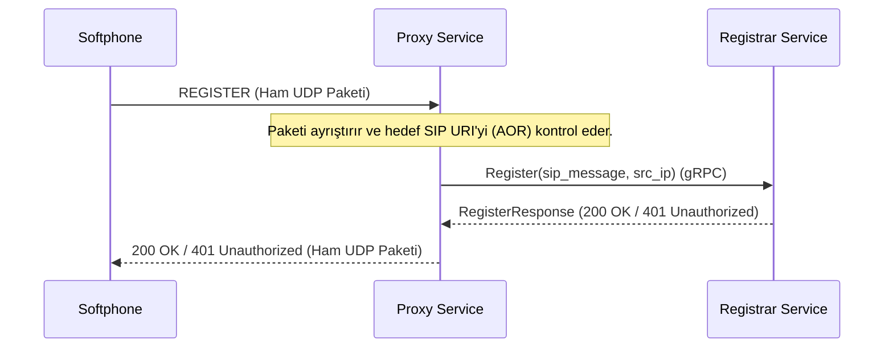
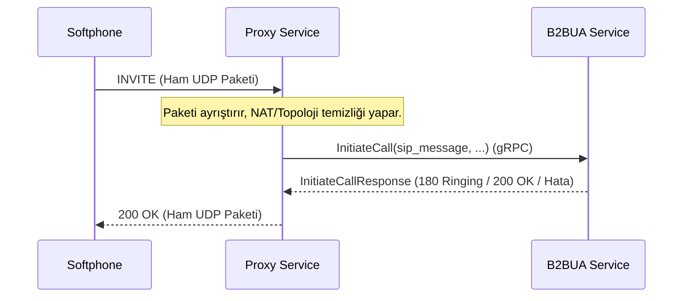

# 🛡️ Sentiric Proxy Service - Mantık ve Akış Mimarisi

**Stratejik Rol:** SIP trafiğini alarak uygun iç servise yönlendiren ve yük dengeleme yapan L4/L7 proxy.

---

## 1. Yönlendirme Akışı: REGISTER İsteği

## 2. Yönlendirme Akışı: INVITE (Çağrı Kurulumu)

