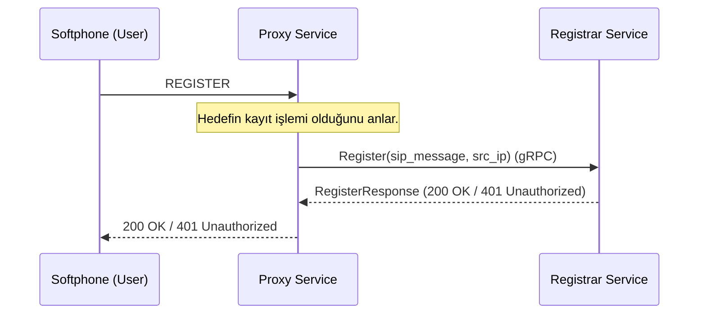
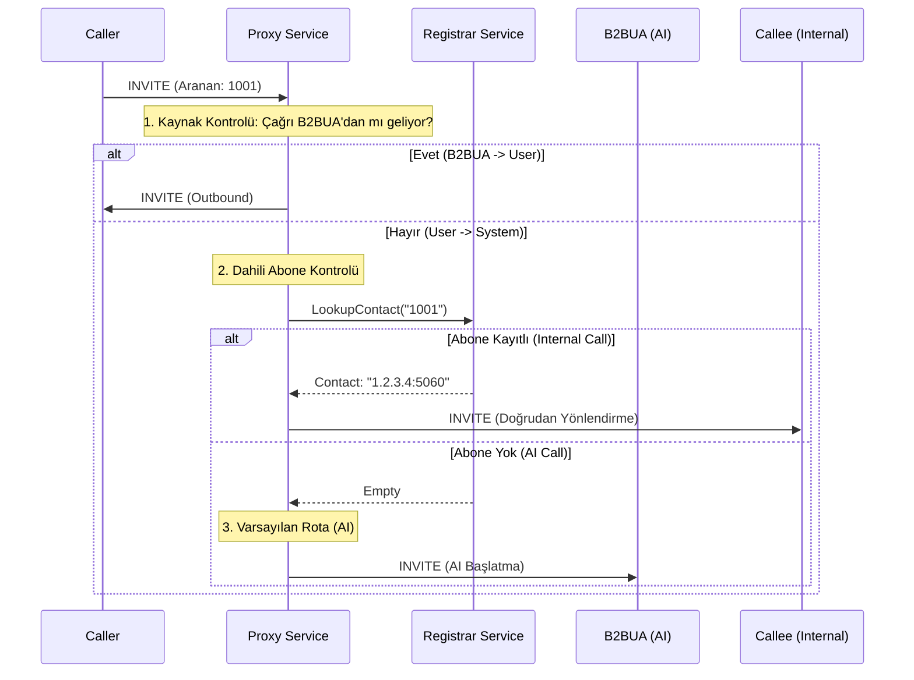

# 🛡️ Sentiric Proxy Service - Mantık ve Akış Mimarisi

**Stratejik Rol:** SIP trafiğini karşılayan, analiz eden ve doğru hedefe (Dahili Abone veya AI Motoru) yönlendiren akıllı yönlendirici.

---

## 1. Yönlendirme Akışı: REGISTER İsteği (Kimlik Kaydı)

```mermaid
sequenceDiagram
    participant User as Softphone (User)
    participant Proxy as Proxy Service
    participant Registrar as Registrar Service

    User->>Proxy: REGISTER
    Note over Proxy: Hedefin kayıt işlemi olduğunu anlar.
    Proxy->>Registrar: Register(sip_message, src_ip) (gRPC)
    Registrar-->>Proxy: RegisterResponse (200 OK / 401 Unauthorized)
    Proxy-->>User: 200 OK / 401 Unauthorized
```

## 2. Yönlendirme Akışı: INVITE (Çağrı Kurulumu)

Proxy, gelen bir çağrıyı yönlendirirken aşağıdaki **Karar Ağacını** uygular:

```mermaid
sequenceDiagram
    participant User as Caller
    participant Proxy as Proxy Service
    participant Registrar as Registrar Service
    participant B2BUA as B2BUA (AI)
    participant Callee as Callee (Internal)

    User->>Proxy: INVITE (Aranan: 1001)
    
    Note over Proxy: 1. Kaynak Kontrolü: Çağrı B2BUA'dan mı geliyor?
    
    alt Evet (B2BUA -> User)
        Proxy->>User: INVITE (Outbound)
    else Hayır (User -> System)
        Note over Proxy: 2. Dahili Abone Kontrolü
        Proxy->>Registrar: LookupContact("1001")
        
        alt Abone Kayıtlı (Internal Call)
            Registrar-->>Proxy: Contact: "1.2.3.4:5060"
            Proxy->>Callee: INVITE (Doğrudan Yönlendirme)
        else Abone Yok (AI Call)
            Registrar-->>Proxy: Empty
            Note over Proxy: 3. Varsayılan Rota (AI)
            Proxy->>B2BUA: INVITE (AI Başlatma)
        end
    end
```

### Karar Matriksi

| Durum | Kontrol | Aksiyon | Hedef |
| :--- | :--- | :--- | :--- |
| **Outbound** | Kaynak IP == B2BUA IP? | Çağrıyı kullanıcıya ilet. | `Request-URI` |
| **Internal** | Hedef URI `registrar`'da kayıtlı mı? | Çağrıyı aboneye ilet. | `Registered Contact IP` |
| **Default** | Yukarıdakilerin hiçbiri değilse. | Çağrıyı AI motoruna ilet. | `b2bua-service` |

---
