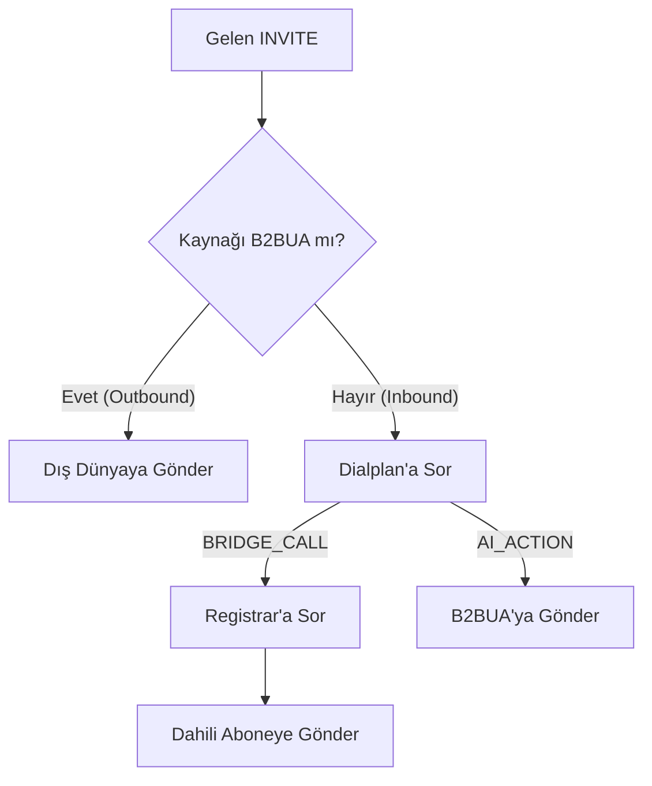

# 🛡️ Sentiric Proxy Service - Mantık Mimarisi (Final)

**Rol:** Platformun Trafik Polisi. Stateless (Durumsuz) Sinyalleşme Yönlendiricisi.

## 1. Karar Matriksi (Routing Logic)

Proxy, gelen her `INVITE` paketi için şu sırayı izler:

1.  **Kaynak Kontrolü (Outbound Check):**
    *   Paket `b2bua-service`'ten mi geliyor?
    *   **Evet:** Hedef dış dünyadır (PSTN/GSM). Paketi değiştirmeden hedefe ilet.
    *   **Hayır:** Bu bir iç/gelen çağrıdır. Adım 2'ye geç.

2.  **Hedef Analizi (Dialplan Lookup):**
    *   `dialplan-service`'e sor: "Bu numara (Aranan) kime ait ve ne yapmalıyım?"
    *   **Yanıt (Action):**
        *   `BRIDGE_CALL`: Dahili arama. Adım 3'e geç.
        *   `START_AI_*`: AI çağrısı. Adım 4'e geç.

3.  **Dahili Yönlendirme (Internal):**
    *   `registrar-service`'e sor: "Aranan kullanıcı şu an hangi IP'de?"
    *   Gelen IP adresine paketi yönlendir. (Medya P2P akar, sunucuya uğramaz).

4.  **AI Yönlendirme (Core):**
    *   Paketi `b2bua-service`'e yönlendir. (Medya sunucu üzerinden akar).

## 2. Akış Diyagramı

```mermaid
graph TD
    A[Gelen INVITE] --> B{Kaynağı B2BUA mı?};
    B -- Evet (Outbound) --> C[Dış Dünyaya Gönder];
    B -- Hayır (Inbound) --> D[Dialplan'a Sor];
    
    D -- BRIDGE_CALL --> E[Registrar'a Sor];
    E --> F[Dahili Aboneye Gönder];
    
    D -- AI_ACTION --> G[B2BUA'ya Gönder];
```

---
